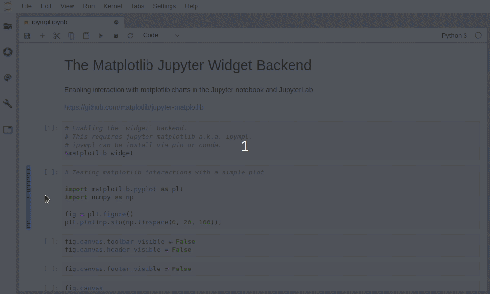

# ipympl

[](https://travis-ci.com/matplotlib/ipympl)
[](https://pypi.python.org/pypi/ipympl)
[](https://anaconda.org/conda-forge/ipympl)
[](https://www.npmjs.com/package/jupyter-matplotlib)
[](https://mybinder.org/v2/gh/matplotlib/ipympl/stable?urlpath=%2Flab%2Ftree%2Fexamples%2Fipympl.ipynb)
[](https://gitter.im/jupyter-widgets/Lobby)

Leveraging the Jupyter interactive widgets framework, `ipympl` enables the interactive features of matplotlib in the Jupyter notebook and in JupyterLab.

Besides, the figure `canvas` element is a proper Jupyter interactive widget which can be positioned in interactive widget layouts.

## Usage

To enable the `ipympl` backend, simply use the `matplotlib` Jupyter
magic:

```
%matplotlib widget
```

## Example
See the [example notebook](https://github.com/matplotlib/ipympl/blob/master/examples/ipympl.ipynb) for more!



## Installation

### With conda:

```bash
conda install -c conda-forge ipympl
```

### With pip:

```bash
pip install ipympl
```

### Install the JupyterLab extension

In order to install the JupyterLab extension `jupyter-matplotlib`, you will first need to install `nodejs` and `npm`.
You can install both with `conda` doing

```bash
conda install -c conda-forge nodejs
```

Starting from ipympl `0.5.6`, **you do not need to manually install the JupyterLab extension**, but you still need to install the JupyterLab widget manager:
```bash
jupyter labextension install @jupyter-widgets/jupyterlab-manager

# If you already installed the @jupyter-widgets/jupyterlab-manager extension, you will still need to rebuild JupyterLab after you installed ipympl
jupyter lab build
```

#### Install an old JupyterLab extension

You will need to install the right `jupyter-matplotlib` version, according to the `ipympl` and `jupyterlab` versions you installed.
For example, if you installed ipympl `0.5.1`, you need to install jupyter-matplotlib `0.7.0`, and this version is only compatible with JupyterLab `1`.

```bash
conda install -c conda-forge ipympl==0.5.1
jupyter labextension install @jupyter-widgets/jupyterlab-manager jupyter-matplotlib@0.7.0
```

Versions lookup table:


| `ipympl` | `jupyter-matplotlib` | `JupyterLab` | `Matplotlib` |
|----------|----------------------|--------------|--------------|
| 0.5.8    | 0.7.4                | 1 or 2       | 3.3.1        |
| 0.5.7    | 0.7.3                | 1 or 2       | 3.2.*        |
| ...      | ...                  | ...          |              |
| 0.5.3    | 0.7.2                | 1 or 2       |              |
| 0.5.2    | 0.7.1                | 1            |              |
| 0.5.1    | 0.7.0                | 1            |              |
| 0.5.0    | 0.6.0                | 1            |              |
| 0.4.0    | 0.5.0                | 1            |              |
| 0.3.3    | 0.4.2                | 1            |              |
| 0.3.2    | 0.4.1                | 1            |              |
| 0.3.1    | 0.4.0                | 0 or 1       |              |

### For a development installation (requires nodejs):

```bash
git clone https://github.com/matplotlib/ipympl.git
cd ipympl
pip install -e .

# If using classic Jupyter Notebook
jupyter nbextension install --py --symlink --sys-prefix ipympl
jupyter nbextension enable --py --sys-prefix ipympl

# If using JupyterLab
jupyter labextension install @jupyter-widgets/jupyterlab-manager --no-build
jupyter labextension install ./js
```

#### How to see your changes
**Javascript**:

To continuously monitor the project for changes and automatically trigger a rebuild, start Jupyter in watch mode:

```bash
jupyter lab --watch
```

After a change wait for the build to finish and then refresh your browser and the changes should take effect.

**Python:**

If you make a change to the python code then you will need to restart the notebook kernel to have it take effect.
